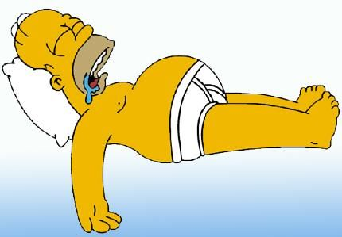

# Les nuits difficiles

Peu de gens sont capables d'estimer une bonne nuit de sommeil à sa juste valeur. Hier encore, je faisais partie de cette population naîve qui dévalue sans respect nos précieuses heures de ronflette quotidienne. 
Et puis il y eut le 15 août... 

S

Moi je dors comme un bébé :D

mais une abeille se posa sur son nez et ...
